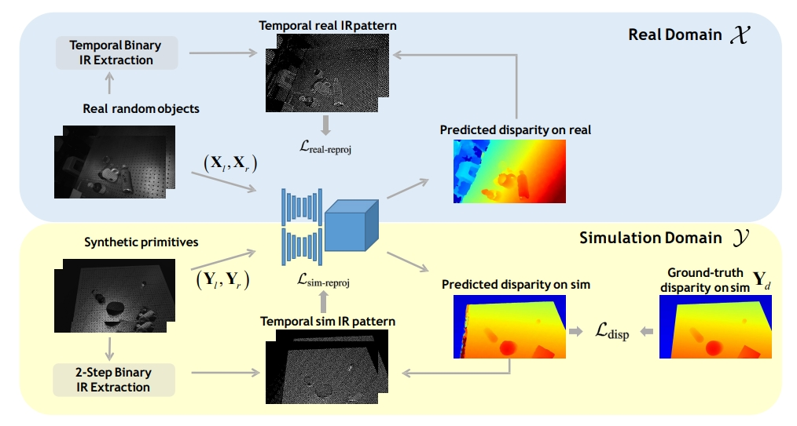
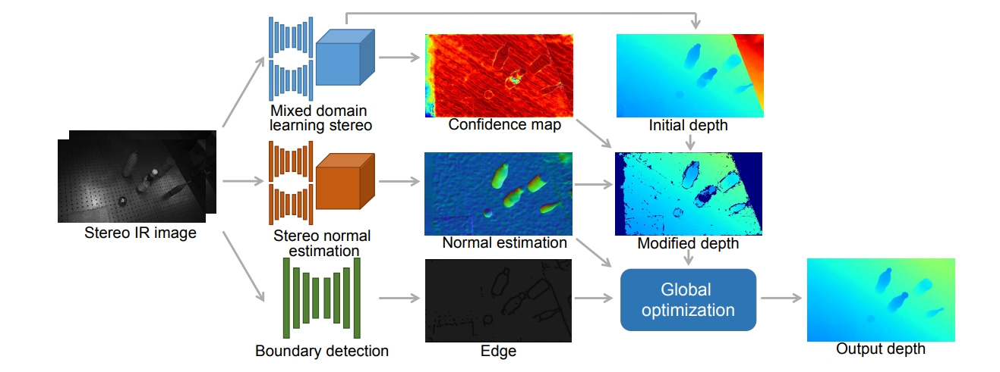

# ActiveZero++: Mixed Domain Learning Stereo and Confidence-based Depth Completion with Zero Annotation
### [[Paper]](https://ieeexplore.ieee.org/document/10219021)
This repository contains the official implementation (in Pytorch) for "ActiveZero++: Mixed Domain Learning Stereo and Confidence-based Depth Completion with Zero Annotation" paper (TPAMI) by Rui Chen, Isabella Liu, Edward Yang, Jianyu Tao, Xiaoshuai Zhang, Qing Ran, Zhu Liu, Jing Xu, and Hao Su.

### Citation
```
@ARTICLE{10219021,
  author={Chen, Rui and Liu, Isabella and Yang, Edward and Tao, Jianyu and Zhang, Xiaoshuai and Ran, Qing and Liu, Zhu and Xu, Jing and Su, Hao},
  journal={IEEE Transactions on Pattern Analysis and Machine Intelligence}, 
  title={ActiveZero++: Mixed Domain Learning Stereo and Confidence-based Depth Completion with Zero Annotation}, 
  year={2023},
  volume={},
  number={},
  pages={1-16},
  doi={10.1109/TPAMI.2023.3305399}}

```

```
@article{zhang2023close,
  title={Close the Optical Sensing Domain Gap by Physics-Grounded Active Stereo Sensor Simulation},
  author={Zhang, Xiaoshuai and Chen, Rui and Li, Ang and Xiang, Fanbo and Qin, Yuzhe and Gu, Jiayuan and Ling, Zhan and Liu, Minghua and Zeng, Peiyu and Han, Songfang and others},
  journal={IEEE Transactions on Robotics},
  year={2023},
  publisher={IEEE}
}
```

```
@inproceedings{liu2022activezero,
  title={ActiveZero: Mixed Domain Learning for Active Stereovision with Zero Annotation},
  author={Liu, Isabella and Yang, Edward and Tao, Jianyu and Chen, Rui and Zhang, Xiaoshuai and Ran, Qing and Liu, Zhu and Su, Hao},
  booktitle={Proceedings of the IEEE/CVF Conference on Computer Vision and Pattern Recognition},
  pages={13033--13042},
  year={2022}
}
```

## Contents
1. [Introduction](#introduction)
2. [Installation](#installation)
3. [Training](#training)
4. [Testing](#testing)
5. [Confidence based Depth Completion](#confidence-based-depth-completion)

## Introduction
We propose a new framework,
ActiveZero++, which is a mixed domain learning solution for active stereovision systems that requires no real world depth annotation. In
the simulation domain, we use a combination of supervised disparity loss and self-supervised loss on a shape primitives dataset. By
contrast, in the real domain, we only use self-supervised loss on a dataset that is out-of-distribution from either training simulation data or
test real data. To improve the robustness and accuracy of our reprojection loss in hard-to-perceive regions, our method introduces a novel
self-supervised loss called temporal IR reprojection. Further, we propose the confidence-based depth completion module, which uses the
confidence from the stereo network to identify and improve erroneous areas in depth prediction through depth-normal consistency.
Extensive qualitative and quantitative evaluations on real-world data demonstrate state-of-the-art results that can even outperform a
commercial depth sensor. Furthermore, our method can significantly narrow the Sim2Real domain gap of depth maps for state-of-the-art
learning based 6D pose estimation algorithms.


<div align=center></div>
<div align=center></div>

## Installation
### Dependencies
The code has been tested on the following system:

- Ubuntu 20.04
- Nvidia GPU (2 3080Ti) and CUDA 12.2
- python 3.8
- pytorch 1.11.0


### Local Installation
```
conda env create -f environment.yml
```

## Dataset
We provide the sample dataset for training and testing. You can find it in folder 'dataset/real' and 'dataset/sim'.  If you want to do the training or inference on your own dataset, you can change the format of your dataset according to out provided dataset.

More specifically, you can follow the instruction to generate the datset:

For dataset in simulation domain, you can generate the simulated dataset using Sapien.To generate the dataset in simulation domain, you can run the following command in the terminal:
```
python data_rendering/render_script.py --sub 1 --total 1 --target-root ./dataset_sim --primitives
```
`--target-root` is the output directory of the rendering data, `--primitives` means you render the data with primitive shape(square, sphere etc.)

For dataset in real domain, you can use Realsense-D415 camera to capture ir images or use other camera by your own.

## Training
We provide an example of training script in `configs/example.yaml` which trains the PSMnet model baseline. All preset configuration information is stored in `active_zero2/config.py`. To train with a different set of configurations, create a new `.yaml` in the `configs` directory that overwrites the configurations you want to change.

To train with one GPU, run following command in the terminal:
```
python active_zero2/train.py --cfg configs/example.yml --local_rank 0
```

To train with multiple GPUs, run following command in the terminal:
```
python -m torch.distributed.launch --nproc_per_node=2 active_zero2/train_2step.py --cfg configs/example.yml
```


## Testing
We provide a sample testing script in `configs/example.yaml` which tests a model called `model_050000.pth` located in `/data_disk/disk1/activezero++_transtouch/active_zero2_clean/outputs/example/` on our testing real and simulation dataset. 
To do the inference, run following command in the terminal:

```
python active_zero2/test.py --cfg configs/example.yml --only
```
For the checkpoint for inference, you need to collect your own real dataset and generate the simulated dataset(mention above in section "Dataset") for training.

You may meet some missing package errors when running the code. Please install the missing packages according to the errors using pip and run the code again.

## Confidence based Depth Completion
To run the confidence based depth completion module, run following command in the terminal:
```
python active_zero2/inpainting/inpaint_d2d.py -d /data_disk/disk1/transtouch/dataset_transtouch/dataset_full/dataset -p /data_disk/disk1/transtouch/transtouch_backend/activezero2/outputs/baseline/model_070000_test -s /data_disk/disk1/transtouch/dataset_transtouch/dataset_full/ts_test_less.txt -c 0.8 -n 50 -a 300 --cfg /data_disk/disk1/activezero++_transtouch/active_zero2_clean_orig/active_zero2_clean/configs/example.yml
```
`-d` is the path to the test dataset, `-p` is the path of output directory, `-s` is the path to the split file of the test dataset.

`-c` is the confidence threshold, `-n` is the normal threshold, `-a` is the area threshold. We set the default value to be 0.8, 50, and 300 respectively. `--cfg` is the path to the configuration file.

Before running the code of depth completion, please make sure that you change the 197th line in `active_zero2/inpainting/inpaint_d2d.py` to the path of the compiled Depth2Depth module. You can find the code of Depth2Depth in this [link]( https://github.com/Shreeyak/cleargrasp). You need to compile the Depth2Depth module and change the path in `active_zero2/inpainting/inpaint_d2d.py`(197th line) to the path of the compiled module.

